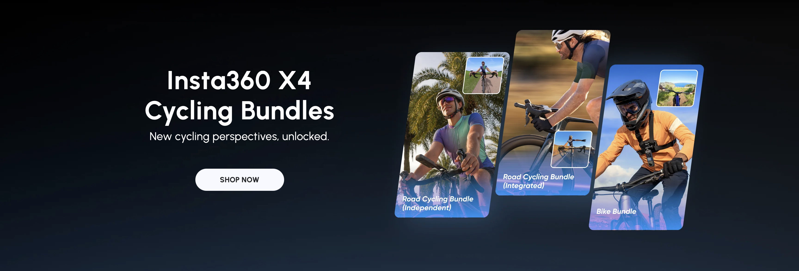

# Procesverslag
Markdown is een simpele manier om HTML te schrijven.  
Markdown cheat cheet: [Hulp bij het schrijven van Markdown](https://github.com/adam-p/markdown-here/wiki/Markdown-Cheatsheet).

Nb. De standaardstructuur en de spartaanse opmaak van de README.md zijn helemaal prima. Het gaat om de inhoud van je procesverslag. Besteedt de tijd voor pracht en praal aan je website.

Nb. Door *open* toe te voegen aan een *details* element kun je deze standaard open zetten. Fijn om dat steeds voor de relevante stuk(ken) te doen.

## Jij

  
uitwerken voor kick-off werkgroep

  ### Auteur:
  Tristan Valkenburg

  #### Je startniveau:
  Blauw, na een jaar weg van de opleiding moet ik weer even wennen aan coderen

  #### Je focus:
  Ik ga mijn focus leggen op de Surface Plane

## Je website

  
uitwerken voor kick-off werkgroep

  ### Je opdracht:
  https://www.insta360.com 
  #### Screenshot van de eerste pagina: 
  Insta360 Homepage
   
  

  #### Screenshot(s) van de tweede pagina:
  
 

## Toegankelijkheidstest 1/2 (week 1)

  
uitwerken na test in 2e werkgroep

  ### Bevindingen
  - Doormiddel van de screenreader kwam ik nergens op de insta360 wesbite. Ik weet niet zeker of dit ligt aan mij, of aan de site, maar als gebruiker was ik in ieder geval snel afgehaakt. In Insta360's defense: mensen met een visuele beperking zijn niet per se de doelgroep voor een camera bedrijf. Maar toch vind ik dat dit beter moet kunnen.

  - Mensen met een visuele of motorieke beperking kunnen bepaalde Acessibility Features goed gebruiken om het web te surfen.
  - Veel hedendaagse Websites zijn nog niet goed geoptimaliseerd voor (bijvoorbeeld) een screenreader, dit maakt het lastig voor mensen met een visuele beperking om said website te gebruiken.
  - high contrast mode kan een dealmaker feature zijn voor visueel beperkte mensen.
  - het is belangrijk om bijvoorbeeld links grote hitboxes te geven zodat mensen met een motorieke beperking minder nauwkeurig hoeven te klikken.
  - Iets waar ik eerder nog niet veel gedachten aan had besteed is een optie om Motion te minderen voor prikkelgevoelige users. Dit kan bijvoorbeeld een pauzeknop zijn voor een autoplay video op een homepagina van een webshop.
  

## Breakdownschets (week 1)

  
uitwerken na afloop 3e werkgroep

  ### de hele pagina: 
  

## Voortgang 1 (week 2)

  
uitwerken voor 1e voortgang

  ### Stand van zaken
  Aangezien ik er een jaartje tussenuit was bij CMD had ik wellicht iets meer moeite met opstarten dan mijn nieuwe klasgenoten. Ik moest nog een nieuwe laptop bemachtigen aan het begin van het jaar en daarbovenop moet ik al mijn HTML-, CSS- en JS-kennis (of wat er nog van over is) weer opgraven en losbikken uit de donkere gaten en kieren in mijn hoofd. Dat kost tijd. Al met al heb ik niet de snelste start gemaakt dit jaar, maar ik heb er vertrouwen in dat ik in de loop van de weken wel weer op mijn pootjes terecht zal komen.

  ### Verslag van meeting
  hier na afloop snel de uitkomsten van de meeting vastleggen

  - Eerst was ik van plan 2 ingewikkelde paginas te bouwen, maar een studentassistent heeft mij dit afgeraden en ik heb besloten een homepage en een minder complexe detailpagina na te bouwen.
  - In de carousel van de insta360 webite zijn de header tekst en buttons van de carousel al onderdeel van de background image; ze zijn gemaakt in photoshop en niet met symantische code. De student assistent had mij de uitdaging gegeven om de tekst en buttons wel te coderen. 
  - Ik loop best achter, maar het is nog te overzien.
  - Ik moet ervoor zorgen dat ik mijn kennis van 2 jaar geleden weer een beetje terug krijg zodat ik lekker door kan coderen.

## Voortgang 2 (week 3)

  
uitwerken voor 2e voortgang

  ### Stand van zaken
  Ik ben afgelopen week naar Disney geweest. Het was erg leuk en ik heb ervan genoten. Wat bar tegenviel is hoe weinig tijd ik in de praktijk had voor mijn huiswerk. Ik was de hele week zoet met achtbanen rijden en prinsessen ontmoeten! Gelukkig was ik het weekend voor mijn vertrek nog lekker aan de bak geweest. Toch loop ik nog behoorlijk achter.
  Ondanks mijn achterstand ben ik wel blij met het werk dat ik tot nu toe heb kunnen leveren. Voor zover ik weet is het symantisch en voor mijn doen is het redelijk complex. Bijna alles waar ik me toe heb gezet is me gelukt om te coderen.

  Hier zijn een aantal dingetjes waar ik blij mee ben:

  Zoals ik zei moest ik voor symantiek de kopjes en buttons in de header carousel coderen. Ik was begonnen met het photoshoppen van de originele background images.

  
    
  Nu was aan mij de taak om het bovenste plaatje na te maken met HTML en CSS  
  
  
    
  Op mijn webite wordt niet de volle breedte van de image gedisplayed, maar de kopjes zijn haast 1 op 1

  Iets anders waar ik wel blij mee ben zijn de arrow buttons op mijn pagina.

  

  
  HTML:

    <a href="#carousel4" class="arrow"></a>
  
  CSS: 

    .arrow {
      display: flex;
      justify-content: center;
      align-items: center;
      transition: all .2s;
    }

    .arrowContainer:not(:hover) .arrow{
      opacity: 0;
    }

    .arrow span {
      display: flex;
      justify-content: center;
      align-items: center;
      background-color: var(--black);
      opacity: .25;
      width: 3rem;
      height: 3rem;
      border-radius: 50%;
    }

    .arrow:hover span { 
      opacity: .5;
    }

    .arrow img {
      height: 1.2rem;
      opacity: 1;
      filter: var(--blackToWhite);
      position: relative;
    }

    /* bigbrain stuff here to make the arrow face the right direction based on the HTML Structure*/
    .arrow img:last-child {
      right: 1.9rem;
    }

    .arrow img:first-child{
      left: 2rem;
      transform: rotate(180deg);
      z-index: 10;
    }

  Om de arrows alleen te displayen als wanneer ze nodig zijn heb ik veel gexperimenteerd: 

    /* show when entering parent - this one works (pretty clever stuff), but is not very practical */
    /* .arrow:has(> *):hover {
      opacity: 1;
    } */

    /* I need to select the parent of the parent of .arrow, but I can't figure out if that's possible. 
    Later, I tried enlarging the hitbox of the arrow's parent to cover the width of the viewport, but this also obstructed all the hyperlinks behind it*/
    /* .arrow:has(> *) {
      height: inherit;
      position: absolute;
      width: 100vw;
    } */

  Na een lange tijd heb ik ervoor gekozen om een class te geven aan het parent element waar binnen ik de arrows wil laten zien. Zodra de cursor zich buiten dat element (bijvoorbeeld een section of span) bevindt, gaat de opacity van de arrows op 0.

    .arrowContainer:not(:hover) .arrow{
      opacity: 0;
    }

  Omdat de arrows natuurlijk naar links en naar rechts moeten wijzen heb ik de CSS zo gescheven dat de direction van de arrow wordt bepaald op basis van de HTML structuur. Als de span (dat is de achtergrond van de button) voor de image (arrow) komt, wijst de arrow naar links, en anders naar rechts. Zelf bedacht, mighty cool of niet dan?

  ### Verslag van meeting
  hier na afloop snel de uitkomsten van de meeting vastleggen

  - Ook de docent is blij met mijn code, dus dat is fijn en kan ik in mijn zak steken.
  - Ik klink als een broken record, maar ik moet gewoon doorknallen om mijn achterstand in te halen.

## Toegankelijkheidstest 2/2 (week 4)

  
uitwerken na test in 9e werkgroep

  ### Bevindingen
  - Ik ben nog steeds erg onhandig met de Apple Screen Reader. Ik kan er gewoon nog niet zo goed mee overweg. Op mijn eigen website niet, en ook op de originele Insta360 website niet...
  - Waar ik wel erg blij mee ben op mijn website is de "Skip To Main Content" Button die ik aan mijn website heb toegevoegd. De originele Insta360 website heeft dit niet. 
  - Iets waar ik bij een groter project meer op zou willen letten is bewust links en elementen te groeperen zodat de pagina makkelijker en efficienter te navigeren is.
  - Ik heb naderhand ook besloten om een prefers-reduced-motion mode toe te voegen aan mijn website. Bepaalde grote animaties zijn hiemee automatisch uitgeschakeld en de transitionspeed van alles is 1.5s in plaats van een snappy .2s.

## Voortgang 3 (week 4)

  
uitwerken voor 3e voortgang

  ### Stand van zaken
  Ik ben eindelijk klaar met mijn eerste (en meest complexe) page!

  Hieronder nog wat kleine dingetjes waar ik blij mee ben:

    
  
    
  Doormiddel van @media heb ik mijn website darkmode user friendly gemaakt. 
  Zelf gebruik ik Dark Mode altijd wanneer mogelijk, dus hier ben ik wel blij mee. 
  Ik moest in mijn Stylesheet wat variabelen aanpassen omdat sommige elementen met dezelfde kleur (en dus met dezelfde var) in Light Mode verschillende kleuren kregen in Dark (dus hadden aparte vars noding).
  In het eerste jaar had ik een App gebouwd met een .js Darkmode Toggle. @media is hier een betere optie voor denk ik nu.

    
  Met deze codesnippit ben ik ook erg blij! Net als al mijn andere code in deze site is dit allemaal zelf geschreven. 
  Wat ik hier doe is twee spans in elkaar nesten en die over elkaar positioneren met relative en absolute positioning, beide hebben een repeating BG IMG van een zwarte ster. 
  De width van de parent span is altijd precies genoeg voor 5 BG IMG repeats, 5 sterren dus.
  De child span heeft een filter die de kleur verandert van zwart naar geel. De breedte van deze span is in procent te definieren.
  Doormiddel van width: calc(2em * [rating]); op de gekleurde sterren kun je in css een rating invullen en wordt het aantal sterren automatisch aangepast.  
  
  

  ### Verslag van meeting
  - Iets belangrijks van de opdracht dat mij compleet over het hoofd is gegaan de afgelpoen weken is dat we de site moesten ontwerpen voor Mobile! Ik ga komend weekend kijken of ik mijn website nog responsive kan maken. Ik heb in het hele project gebruik gemaakt van REM en EM values, dus hopelijk helpt dat.
  - Ik ga nog even een goede laatste slag moeten maken om mijn tweede pagina op tijd te completen.
  - Iets dat ik de afgelopen tijd een beetje heel erg voor me uit heb lopen schuiven is het testen van de screenreader. Ik hoop heel erg dat het goed zit daarmee. Als dit niet het geval blijkt te zijn, zal ik mijn weekendplannen even om moeten gooien ben ik bang.

## Eindgesprek (week 5)

  
uitwerken voor eindgesprek

  ### Je uitkomst - karakteristiek screenshots:
   
   
   
   
   

   
   
   

  ### Dit ging goed/Heb ik geleerd: 
  Korte omschrijving met plaatjes
  - Ik ben best blij met mijn .js integration. Ik was een beetje nerveus om javascript weer te gaan gebruiken aangezien ik het meer dan een jaar niet meer had gebruikt. Natuurlijk is het weer even wennen, maar het is wel gelukt wat basic dingetjes voor elkaar te krijgen. 
    
  - Deze sterren ben ik ook blij mee! Ik had ervoor gekozen om mijn code te futureproofen en geen statische .png's te gebruiken. deze sterren zijn heel makkelijk aan te passen met 1 line in CSS, geen photoshop of Illustrator!  
  
   
  - Voor mijn website heb ik veel arrow linkjes en knoppeb gebruikt. Met uitzondering van wat specifieke tweaks hier en daar zijn ze allemaal met dezelfde flexiebele code gestijld.
  

  ### Dit was lastig/Is niet gelukt:
  - wat mij niet is gelukt is het responsove maken van de website. Op de tweede pagina was het heel makkelijk om de code te schrijven om de elementen in landscape mode te positioneren, maar het lukte me voor geen goud om de @media query te laten doen wat 'ie moest, en ik snap niet hoe. In eerste pagina heb ik niet veel tijd gestoken om 'm responsive te maken, aangezien het me simpelweg niet lukt om de code te activeren. Ik had besloten om mijn tijd te gebruiken om wat extra surface plane features toe te voegen.  
  
  - Iets wat me echt heel erg tegenviel was hoe veel tijd het mij kostte om te coderen. Soms voelde het als een soort bodemloze put waar ik uur na uur na uur in gooide zonder ook maar iets waardevols terug te krijgen. Dit zal wenning en oefening vergen om te verhelpen.

## Bronnenlijst

  
continu bijgehouden

  ### special links:
  1. changing icon colors
  https://codepen.io/sosuke/pen/Pjoqqp
  2. finding matching fonts
  https://en.m.likefont.com/community/100930128/
  3. a11y skip to main
  https://www.a11y-collective.com/blog/skip-to-main-content/

  ##
  ### normal links

  1. https://stackoverflow.com/questions/35269947/how-can-i-align-one-item-right-with-flexbox
  2. https://developer.mozilla.org/en-US/docs/Web/CSS/object-position
  3. https://www.w3schools.com/cssref/pr_background-image.php
  4. https://stackoverflow.com/questions/1014861/is-there-a-css-parent-selector
  5. https://www.w3schools.com/howto/howto_css_hide_scrollbars.asp
  6. https://codeburst.io/how-to-create-horizontal-scrolling-containers-d8069651e9c6
  7. https://gomakethings.com/smooth-scrolling-links-with-only-css/
  8. https://developer.mozilla.org/en-US/docs/Web/CSS/CSS_grid_layout
  9. https://stackoverflow.com/questions/30835168/is-there-an-opposite-css-pseudo-class-to-hover
  10. https://www.w3schools.com/cssref/sel_nth-child.php
  11. https://webdevetc.com/blog/how-to-add-a-gradient-overlay-to-a-background-image-using-just-css-and-html/
  12. https://www.geeksforgeeks.org/how-to-add-shadow-effect-on-hover-to-div-boxes-in-css/
  13. https://stackoverflow.com/questions/18365713/using-auto-in-css-calc
  14. https://stackoverflow.com/questions/10487292/position-absolute-but-relative-to-parent
  15. https://stackoverflow.com/questions/74591767/modify-css-variable-in-media-query
  16. https://stackoverflow.com/questions/2460100/remove-the-complete-styling-of-an-html-button-submit
  17. https://stackoverflow.com/questions/9519841/why-does-this-css-margin-top-style-not-work
  18. https://www.tutorialspoint.com/how-to-call-a-javascript-function-on-a-click-event#:~:text=To%20call%20a%20function%20on,called%20when%20the%20event%20occurs.
  19. https://www.w3schools.com/HOWTO/howto_js_toggle_class.asp
  20. https://stackoverflow.com/questions/5898656/check-if-an-element-contains-a-class-in-javascript
  21. https://www.w3schools.com/js/js_if_else.asp
  22. https://stackoverflow.com/questions/52097840/how-to-overwrite-text-in-p-tag-using-javascript
  23. https://stackoverflow.com/questions/71462733/play-sound-on-click-anywhere

